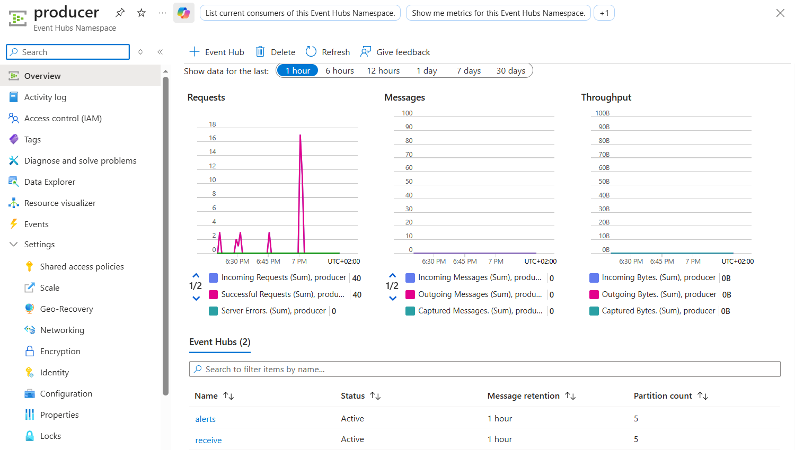
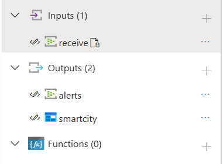
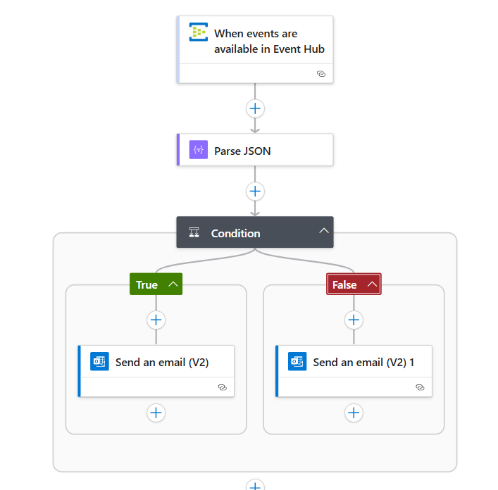
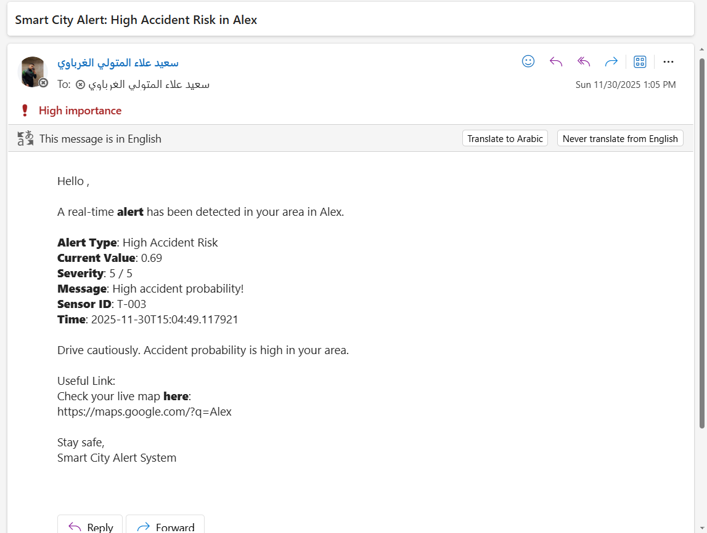
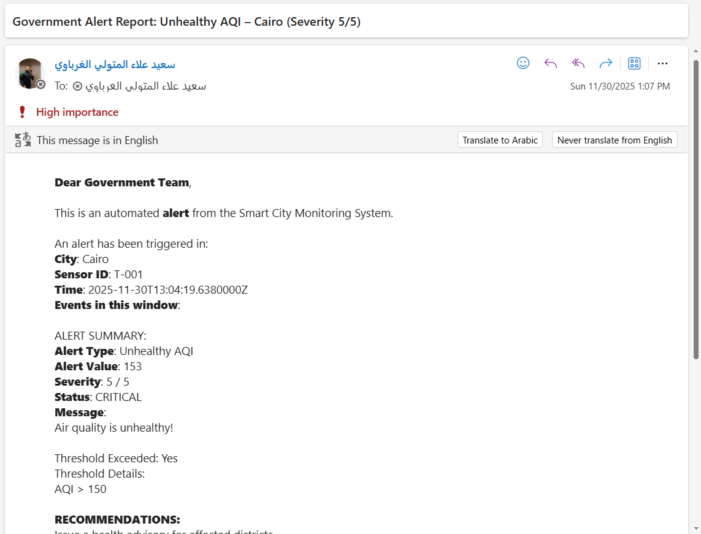
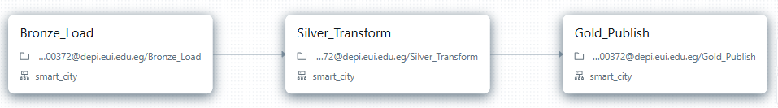
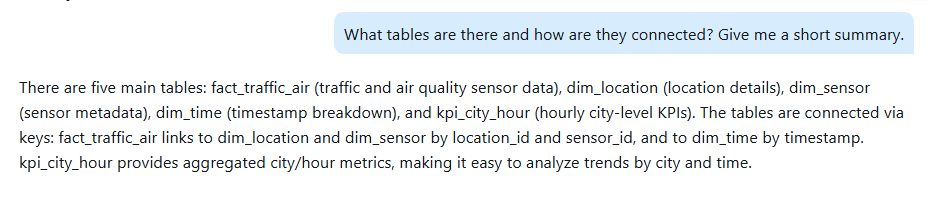
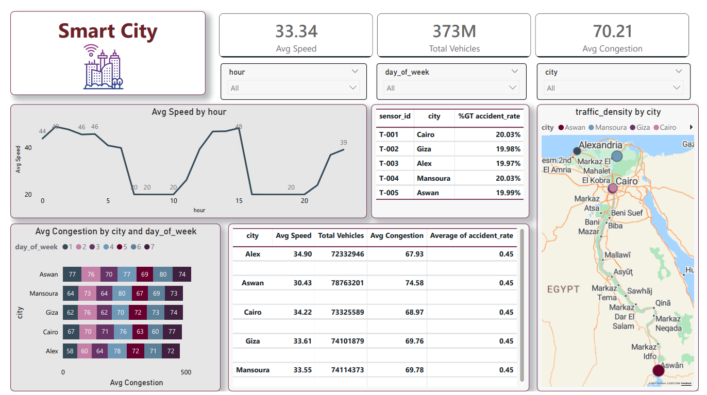
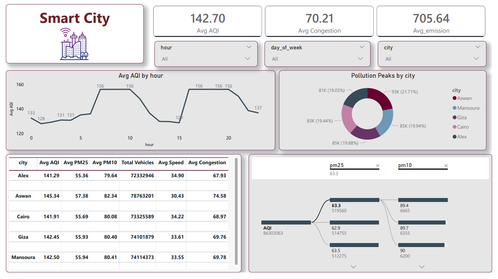

# Real-Time City Data Pipeline & Alerting System

  

A scalable Azure-native platform for monitoring urban traffic and air quality in real-time. Processes ~12K sensor events/hour across 5 Egyptian cities (Cairo, Alexandria, etc.), generating instant alerts for congestion/pollution and historical KPIs via Medallion ETL.

(Real-time pipeline: Sensors → Event Hub → Stream Analytics → Logic App/Databricks)

## Problem Statement

Urban cities like Cairo face severe traffic jams (avg. 2-hour delays) and air pollution (AQI >150 peaks), but fragmented sensor data leads to delayed alerts and siloed analytics. Traditional systems can't handle 187 KB/s streams, missing critical interventions for safety and health.

## Solution Overview

This project builds a hybrid Lambda architecture for real-time detection and batch insights:
- **Real-Time Detection**: Classifies alerts with severity (1-5 scale) using Stream Analytics.
- **Notifications**: Immediate high-priority emails via Logic App, tailored by audience (citizens vs. government).
- **Historical Analytics**: Medallion layers (Bronze → Silver → Gold) in DataBricks for trends, KPIs (e.g., vehicles/km, AQI compliance), and ML-ready data.
- **Intelligent Querying**: Genie AI agent answers natural questions like "What's the AQI trend in Cairo during peak hours?" on Gold layer data.

Achieves 5s alert latency, 30% data reduction, and 90% faster responses.

## Architecture & Components

### 1. Real-Time Ingestion
- **Sensors**: Simulate merged traffic + air readings every 5 seconds (Python producer with random fluctuations for realism).
- **Azure Event Hub**: Captures high-velocity streams (187 KB/s); partitions by city for scalability.

### 2. Processing with Stream Analytics
- Ingests from Event Hub; applies unified SQL queries to classify alerts
- Outputs to 2 destinations:
  - **Event Hub (alerts-output-hub)**: For immediate notifications.
  - **Blob Storage (blobarchive)**: daily CSV appends for historical data.

### 3\. Notifications via Logic App

*   Triggered by alerts EventHub (polls every 1 minute); parses JSON payload.
    
*   Filters by audience ('citizen' → safety tips + Google Maps link; 'gov' → detailed report + recommendations like "Issue health advisory").
    

### 4\. Historical & Analytics Layer (Databricks Medallion Architecture)

*   **Bronze**: Raw ingestion from Blob CSV; adds metadata (ingestion_ts, source_file); Delta table for ACID.
    
*   **Silver**: Deduplicates on keys (sensor_id, timestamp); drops nulls; casts types; derives features (hour from timestamp).
    
*   **Gold**: Star schema (dim_time/location/sensor + fact_traffic_air); aggregated KPIs (avg_aqi, total_vehicles, emission_per_100_vehicles).
    

Automated via DataBricks Workflows (hourly cron jobs); uses Unity Catalog for governance.   

### 5\. Intelligent Querying with Genie

*   **Setup**: LLM agent on Gold layer; prompts guide schema-aware SQL generation (e.g., JOIN fact_traffic_air with dim_location)
    
*   **Tailored for roles**: Citizens: "Safe routes?"; Gov: "Pollution peaks count?".
    
*   Example: 

### 6\. Visualization with Power BI

*   Traffic Page: KPI cards, line charts (speed vs. hour), maps (congestion bubbles).

*   Air Page: 

### Prerequisites

*   Azure Subscription (Event Hub, Stream Analytics, Blob Storage, Logic App, Databricks, Power BI).
    
*   Python 3.8+ for simulation generator.

*   Office 365 connector for emails.s
    

    

    

